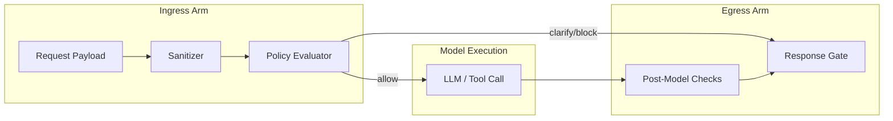

# LLM Guardrail Core Runtime


The Guardrail API is the **core runtime** behind the Guardrail firewall. It runs in-band with your
LLM traffic to inspect ingress/egress prompts, enforce policy packs, and emit signed audit events
for downstream observability. This repo contains the enforcement engine, REST API surface, and the
foundational rule execution pipeline. Deployment tooling, dashboards, and admin interfaces live in
the umbrella docs portal referenced below.

> **Ingress/Egress arms are independent; partial degradation maintains safety.**

## Quickstart sanity check

```bash
pip install guardrailapi
python -m guardrailapi.demo
# or, for API-only installs:
curl -s http://localhost:8000/chat -X POST -d '{"text": "hi"}'
```

## Run it locally
```bash
# install dependencies (includes the API runtime and shared rulepacks)
uv sync  # or: pip install -e .[server]

# boot the ASGI server
uv run python -m app.main

# health probe
curl -s http://localhost:8000/healthz
```

## Docs & references
Full product documentation lives in the Guardrail umbrella portal. Jump directly to:

- [Quickstart](https://docs.guardrail.dev/portal/quickstart)
- [Policy Packs](https://docs.guardrail.dev/portal/policy-packs)
- [Confusables backlog (P1)](https://docs.guardrail.dev/portal/confusables-p1)
- [API reference](https://docs.guardrail.dev/portal/api)

Looking for deployment blueprints, dashboards, or advanced tuning guides? These also live in the
umbrella portal so they stay in sync with the managed platform releases.

## Clarify-First Dual-Arm Architecture



The clarify-first design ensures ingress and egress decisions are isolated. Ingress sanitization and
policy decisions run before the model executes; egress verification wraps the model output and can
lock execution without bypassing ingress outcomes. Both arms emit decision, mode, and incident
headers so downstream systems can reason about safety posture in real time.
