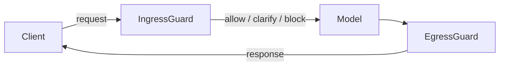

# Core runtime architecture (v1.4)

## Dual-arm flow

The runtime now isolates ingress and egress processing into independent guard arms. IngressGuard
evaluates the incoming payload, issues a decision (allow, clarify, block), and forwards sanitized
content to the model. After model inference, EgressGuard evaluates the generated response before it
returns to the client. Each arm records its disposition and emits the following headers:

- `X-Guardrail-Decision-Ingress`
- `X-Guardrail-Decision-Egress`
- `X-Guardrail-Mode-Ingress`
- `X-Guardrail-Mode-Egress`
- `X-Guardrail-Incident-ID`

### Failure isolation rules

- Ingress blocks stop the request. The model and egress arms are skipped, and decision headers are
  still returned.
- If the egress arm throws an exception, the runtime responds with `500` and the last known guard
  headers so the client can correlate the incident.
- Independent failure domains mean that an ingress outage does not block egress mitigations and vice
  versa.
