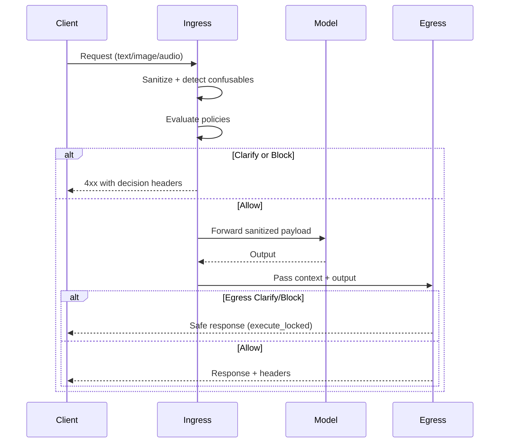

# Clarify-First Dual-Arm Flow

The clarify-first runtime splits enforcement into two isolated "arms" so degradation in one stage
never compromises safety:

- **Ingress arm** applies Unicode normalization, confusable detection, and policy evaluation before
  the model executes. Failures return `block_input_only` decisions with incident IDs.
- **Egress arm** verifies the model output independently. Failures trigger `execute_locked`
  responses that withhold or transform the payload.
- **Headers**: every response carries `X-Guardrail-Decision-*`, `X-Guardrail-Mode-*`, and
  `X-Guardrail-Incident-ID` so downstream systems can observe guardrail posture.
